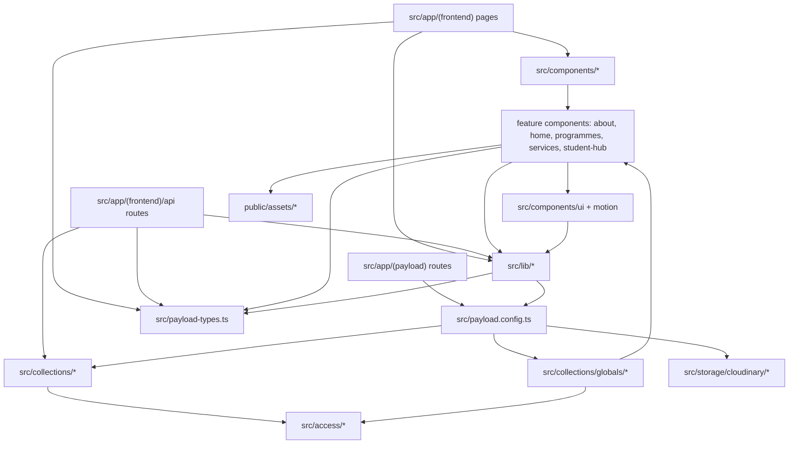

# AFRS Web App Architecture Map

This map explains the main file hierarchy and dependency chain for the app.

## High-Level Tree

```text
src/
├── app/
│   ├── (frontend)/      Next.js public pages and API routes
│   └── (payload)/       Payload admin, REST, and GraphQL routes
├── access/              Shared Payload access-control rules and presets
├── collections/         Payload collection and global schemas
├── components/          UI, page sections, feature views, and forms
├── hooks/               Shared React hooks
├── lib/                 Payload client, CMS helpers, API helpers, data loaders
├── migrations/          Database migrations
├── storage/             Cloudinary storage adapter
├── payload.config.ts    Payload root configuration
└── payload-types.ts     Generated Payload types
```

## Dependency Graph



## Important Chains

- Public route chain: `src/app/(frontend)/*/page.tsx` loads CMS data through `src/lib/payload.ts` and `src/lib/cms.ts`, then renders feature components under `src/components/*`.
- Registration route chain: `src/app/(frontend)/api/*/initiate/route.ts` uses `src/lib/apiResponses.ts` for shared validation/error JSON, then creates Payload registration records.
- Student Hub event chain: `student-hub/ugc-net/page.tsx` and `student-hub/fact/page.tsx` both use `src/components/student-hub/eventSummaries.server.ts`, which fetches published upcoming events and maps them into `UgcNetExperience` props.
- Payload schema chain: `src/payload.config.ts` registers every collection/global, storage adapter, database adapter, editor, and generated type output.
- Access-control chain: collection/global configs depend on named presets in `src/access/index.ts`, keeping repeated permission rules in one place.
- Media chain: `src/storage/cloudinary/*` is wired into Payload through `src/payload.config.ts`; frontend media display resolves URLs through `src/lib/cms.ts`.

## Refactor Boundary

- Shared code should live in `src/lib` when it supports routes, API handlers, or CMS data shaping.
- Shared design or rendering pieces should live in `src/components/ui` or the nearest feature folder.
- Payload access rules should stay centralized in `src/access/index.ts`.
- Collection/global files should describe schema shape, not duplicate permission policy or route logic.
